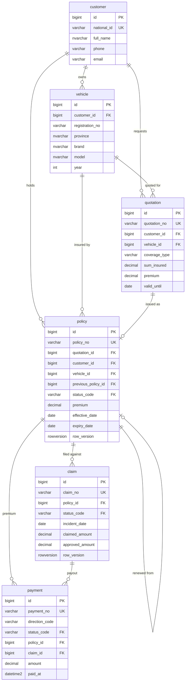

# ER Diagram

```mermaid
erDiagram
  customer ||--o{ vehicle : owns
  customer ||--o{ quotation : requests
  customer ||--o{ policy : holds
  vehicle  ||--o{ quotation : "quoted for"
  vehicle  ||--o{ policy : "insured by"
  quotation ||--o| policy : "issued as"
  policy   ||--o{ claim : "filed against"
  policy   ||--o{ payment : "premium"
  claim    ||--o{ payment : payout
  policy   ||--o| policy : "renewed from"

  customer {
    bigint id PK
    varchar national_id UK
    nvarchar full_name
    varchar phone
    varchar email
  }
  vehicle {
    bigint id PK
    bigint customer_id FK
    varchar registration_no
    nvarchar province
    nvarchar brand
    nvarchar model
    int year
  }
  quotation {
    bigint id PK
    varchar quotation_no UK
    bigint customer_id FK
    bigint vehicle_id FK
    varchar coverage_type
    decimal sum_insured
    decimal premium
    date valid_until
  }
  policy {
    bigint id PK
    varchar policy_no UK
    bigint quotation_id FK
    bigint customer_id FK
    bigint vehicle_id FK
    bigint previous_policy_id FK
    varchar status_code FK
    decimal premium
    date effective_date
    date expiry_date
    rowversion row_version
  }
  claim {
    bigint id PK
    varchar claim_no UK
    bigint policy_id FK
    varchar status_code FK
    date incident_date
    decimal claimed_amount
    decimal approved_amount
    rowversion row_version
  }
  payment {
    bigint id PK
    varchar payment_no UK
    varchar direction_code
    varchar status_code FK
    bigint policy_id FK
    bigint claim_id FK
    decimal amount
    datetime2 paid_at
  }
```

หมายเหตุ: `policy` และ `claim` เป็น system-versioned temporal tables — มี history table (`policy_history`, `claim_history`) เก็บทุกเวอร์ชันของ row อัตโนมัติสำหรับ audit
